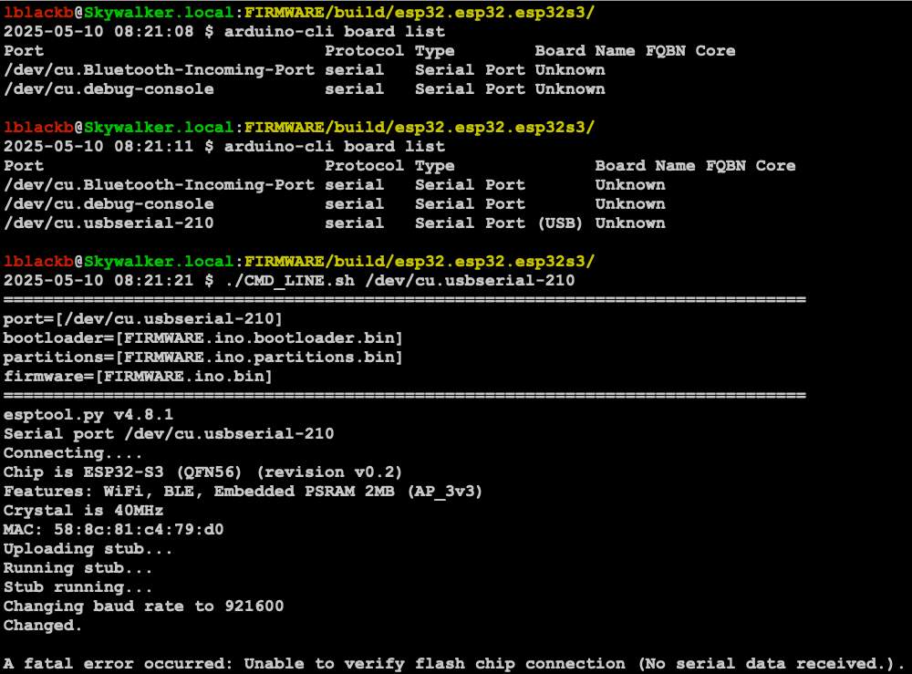
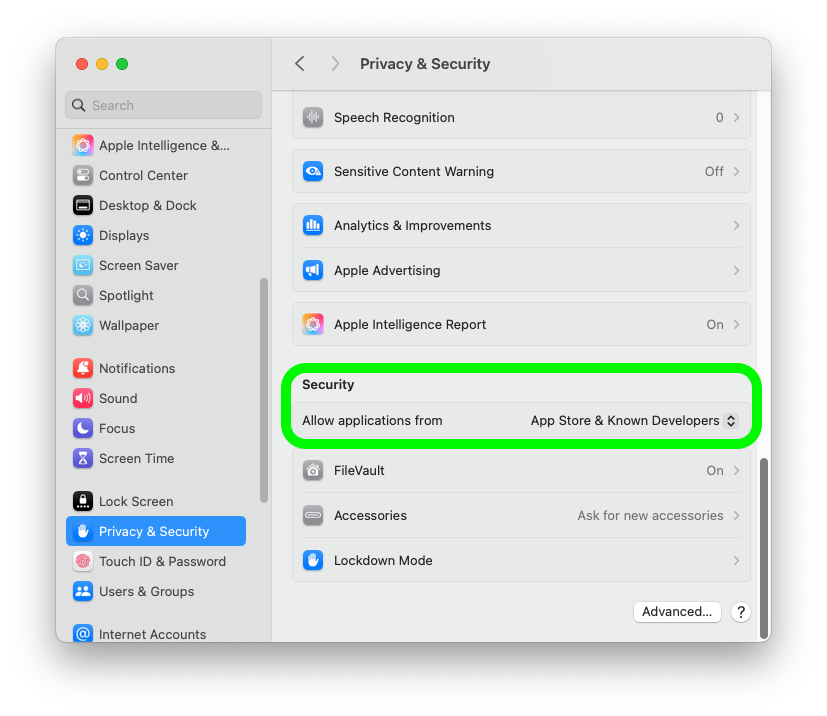

mac install instructions that work added to [README.md](README.md#macoslinux-setup).

# Setup Issue
The error message below was returned when trying to load the firmware with python using the [./FIRMWARE/build/esp32.esp32.esp32s3/CMD_LINE.sh](./FIRMWARE/build/esp32.esp32.esp32s3/CMD_LINE.sh) script.
```
A fatal error occurred: Unable to verify flash chip connection (No serial data received.).
```
[](./setup_issue/setup_issue.png)

The issue seems to be with installing the driver.  I followed [these instructions](https://learn.sparkfun.com/tutorials/how-to-install-ch340-drivers/mac-osx) to install the OSX driver.

When connecting the badge and before installing the driver, the port is listed as `/dev/cu.usbserial-210`
```
$ ls -la /dev/tty.*usb*
crw-rw-rw-  1 root  wheel  0x9000002 May 11 05:24 /dev/tty.usbserial-210
```

The ReadMe.pdf `CH34X USB-SERIAL DRIVER INSTALLATION INSTRUCTIONS` expects `/dev/tty.wchusbserial*`.

After running the driver installer, the driver is added to `/Library/Extensions` as below and the port is listed as `/dev/cu.usbserial-210`.
```
$ ls -lad /Library/Extensions/usb*
drwxr-xr-x  3 root  wheel  96 Jul  4  2018 /Library/Extensions/usbserial.kext
```

It appears the driver may be blocked running as I did not see an
approval request.  The `Security & Privacy` settings are set to `App
Store & Known Developers`.  Althought, Apple has changes the UI around
this setting.... again.
[](./setup_issue/osx_security_setting.png)

At this point I think the issue is an MDM setting or a new Apple
setting to prevent new drivers from being installed.  I remember
having to do something special to allow another driver at one point.
Trying to find that doc and will add it here.

# Other Stuff I tried
## install arduino-esp32 (DO NOT DO THIS)
* use the pip command to install
* https://docs.espressif.com/projects/arduino-esp32/en/latest/installing.html#macos
```
git clone https://github.com/espressif/arduino-esp32.git
cd arduino-esp32/tools
python get.py
```

# Random other links
* [LinkedIn Fox Pick post](https://www.linkedin.com/posts/fox-pick_badgelife-conlife-bsides-activity-7325704175009374208-14-E/)
* [LinkedIn Morgan Rogers](https://www.linkedin.com/in/morgan-rogers-b0b719112/)
* Fox Pick email: info@fox-pick.com
