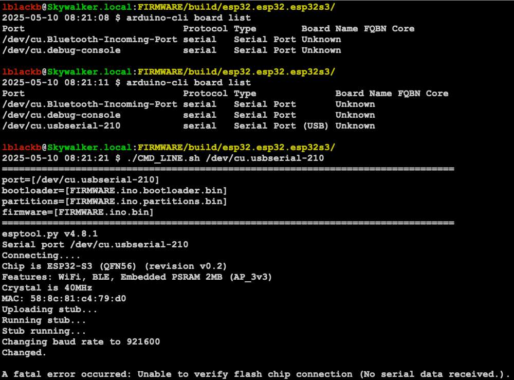

# Setup Issue
The error message below was returned when trying to load the firmware with python using the [./FIRMWARE/build/esp32.esp32.esp32s3/CMD_LINE.sh](./FIRMWARE/build/esp32.esp32.esp32s3/CMD_LINE.sh) script.
```
A fatal error occurred: Unable to verify flash chip connection (No serial data received.).
```
[](./setup_issue.png)

# Other Stuff I tried
## install arduino-esp32 (DO NOT DO THIS)
* https://docs.espressif.com/projects/arduino-esp32/en/latest/installing.html#macos
```
git clone https://github.com/espressif/arduino-esp32.git
cd arduino-esp32/tools
python get.py
```

# Random other links
* [LinkedIn Fox Pick post](https://www.linkedin.com/posts/fox-pick_badgelife-conlife-bsides-activity-7325704175009374208-14-E/)
* [LinkedIn Morgan Rogers](https://www.linkedin.com/in/morgan-rogers-b0b719112/)
* Fox Pick email: info@fox-pick.com
